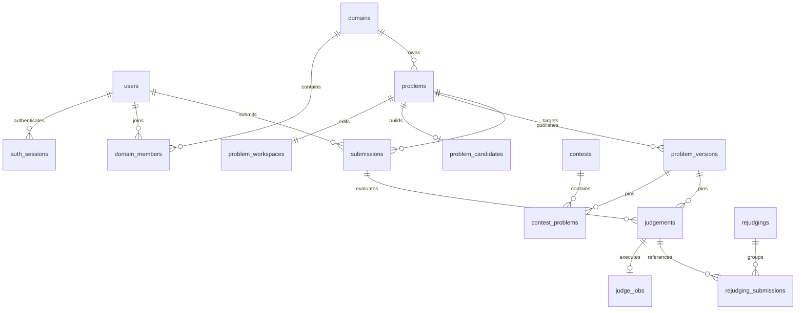

# Vertex OJ — 数据库设计

PostgreSQL 16 是唯一业务事实源。固定 SQL 由各上下文私有的 sqlc 包生成，事务由所属 repository 协调。完整模型图见[后端模型与身份边界](15-backend-models.md)。

## 域与公开身份

资源主键使用内部 UUID。题目、比赛、提交、题解、题单、公告和 group 的公开编号使用 `public_id BIGINT`，以 `(domain_id, public_id)` 唯一约束限定作用域。`domain_number_counters` 按域和资源种类分配编号，题目从 1000 开始，其他资源从 1 开始；分配属于插入事务，已提交资源删除后不复用编号。

身份保护触发器禁止更改公开资源的 UUID、公开编号和所属域。关联表通过 `(domain_id, resource_id)` 复合外键拒绝跨域引用。没有隐式 official 域默认值；业务调用、内部任务及测试夹具均必须明确选择域。

数据库和 Worker 使用 UUID；浏览器 API 对已编号资源只使用公开编号字符串。编号可枚举，不是权限凭证。

## 核心关系

## 身份与会话

`users` 保存全站账号；`auth_sessions` 保存 session UUID、user UUID、refresh token hash、有效期、吊销时间和最后使用时间。数据库不保存可复用 refresh token。轮换使用旧 hash 条件更新，同一凭据并发刷新只有一个请求可以成功。

`domains`、`domain_members`、`domain_roles`、`domain_groups` 与成员关系表管理租户及授权。账号和域治理与资源写入遵循一致的锁顺序，在事务内重查权限；站点管理员身份不替代域内资源权限。

## 题目、候选与发布

- `problems`：身份、归属、访问属性、当前发布版本指针、当前公开内容投影和练习统计。
- `problem_workspaces`：可编辑元数据、工作与数据 revision、构建状态；`problem_statements/files/tests` 保存编辑材料。
- `problem_candidates`：当前候选产物，包括版本、数据 revision、构建来源、路径、哈希、样例、checker 和配置。
- `problem_versions`：不可变发布快照；`(problem_id, version_no)` 是比赛与评测引用的版本身份。
- `problem_origins`：独立副本的历史来源证据。其源身份不是实时外键，源资源删除不影响副本。

发布事务确认审核过的工作 revision 与候选产物仍匹配，再创建发布版本并同步 `problems` 投影和标签。修改工作副本不会改变已有发布版本。比赛换版本与重测旧提交是独立操作。

## 提交与评测

`submissions` 保存用户、题目、比赛上下文、源码、语言、提交时间和代次引用。`judgements` 以 `(submission_id, generation)` 为主键，保存固定题目版本、判定、分数、资源用量、编译诊断、进度及逐点 JSON。评测输入受不可变触发器保护。

`judge_generation` 是单调增加的执行代次；`result_generation` 是当前采用的结果，两者均以延迟外键指向实际 judgement。只读视图 `submission_results` 将提交事实与选定结果组合，供榜单、统计和其他读模型查询。

`judge_jobs` 只负责调度与执行租约，引用 judgement，不重复维护题目、域和版本输入。`UNIQUE(submission_id, generation)` 防止同一代重复入队。领取使用 `FOR UPDATE SKIP LOCKED`；`NOTIFY vertex_judge_jobs` 仅用于唤醒，数据库任务表始终是权威队列。

完成时检查 job、generation、worker、lease token 和有效期，并在同一事务写入任务完成状态、judgement 结果和榜单/练习统计。失败全部回滚。心跳进度单调推进，过期重试达到上限后写入 System Error。

逐点结果只保存在 `judgements.case_results`；约束禁止缺失、非正数或重复的测试点序号。不存在第二份 `submission_cases` 镜像。

## 重测与榜单投影

`rejudgings` 保存批次状态，`rejudging_submissions` 保存旧、新评测代次引用，不复制旧结果字段。取消尚未领取的任务时切换 `result_generation`，保留单调递增的执行代次；运行中的任务继续完成。

`contest_submission_cells` 是可重建的计分投影，同时保存内部实时与封榜公开结果。结果、重测及规则修改在原事务内更新受影响的投影；同一选手/题目计分格用 advisory lock 串行重建。投影不是另一份评测事实。

## 查看者查询与隐私

`visible_submissions` 统一列表、count、详情与 progress 的行权限。查询在数据库中过滤并分页，不能先返回或计数不可见记录。读取及后续字段投影共享一个观察时间。

`SubmissionRecord` 保存真实查询结果；`Project` 生成独立的 `SubmissionView` / `ProgressView`，统一源码、编译诊断、反馈与封榜策略，保留原始事实。未知反馈配置按隐藏结果处理。用户进度与主页统计从选定结果推导，权限撤销后重新查询生效。

## 其他资源

`problem_sets` 与条目表保存题单；条目和完成进度按当前题目权限过滤。`editorials`、投票与讨论表保存社区内容，草稿和防剧透规则在服务端生效。`announcements` 是域内公告，公开读取不混入草稿。标签治理更新当前分类及工作副本，不修改不可变发布快照。

## 开发库与生成

目前没有正式环境，所有结构直接维护在 `server/migrations/000001_init.up.sql`，down 脚本按依赖顺序撤销。已有开发库需重建，不维护旧 schema/API 兼容层。测试使用独立 PostgreSQL 库，并验证建表、回滚、外键、权限、并发和结果一致性。

运行 `go -C server generate ./internal/platform/database` 更新私有 sqlc 包；不要手工编辑生成文件。验证流程与事务边界见[后端架构](14-backend-architecture.md)。
