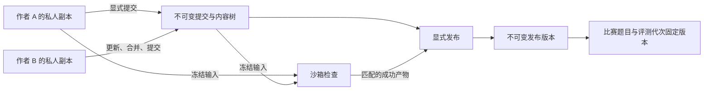

# 出题工作台

入口是“工作台 → 题目”(`/d/{domain}/workspace/problems`)，单题使用 `/d/{domain}/authoring/{题号}/{section}`。基本设置、题面、程序、测试数据、附件、更改、历史、检查、发布、题包和协作使用真实子路径。页面依据当前域和题目权限展示操作；所有授权仍由服务端执行。

设计依据和格式调研见[出题重构调研](research/2026-09-19-authoring-redesign.md)，实现过程见[实施清单](plans/2026-09-19-authoring-workbench.md)，需求映射、验证证据及兼容边界见[验收记录](research/2026-09-20-authoring-acceptance.md)。

## 一份题目的工作流程

1. 新建私人题目，或先创建题目再上传题包预检。
2. 在本人的工作副本编辑题面、程序和测试数据。自动保存只保存副本，不增加提交或发布版本。
3. 在“更改与提交”审阅差异，填写说明并显式提交。协作者看到共享提交；其他人的未提交副本和私人检查不会显示。
4. 对指定副本快照或提交运行检查。程序在 Worker 沙箱中编译、生成、校验和验证，报告绑定检查时的材料。
5. 在“发布”选择提交、匹配的成功检查和题面语言，确认切换公开版本。检查成功不自动发布，提交也不自动发布。
6. 比赛题目固定采用某个发布版本；比赛管理者另行采用新版本，再决定是否重测旧提交。

检查可以发生在提交前。只改题面且评测材料指纹不变时，可以复用之前的成功检查；源码、输入、答案、限制或校验规则变化后需要重新检查。

## 副本、提交和冲突

每位作者拥有独立副本，以 `(problem, actor)` 定位。内容保存要求当前 etag；陈旧请求返回冲突，不覆盖更新内容。相同内容重复保存不增加提交，也不无意义地改变 etag。

共享 head 变化时，更新副本使用共同祖先进行三方合并。文本的独立修改、结构化文档的不同字段可合并；二进制不自动拼接。真正冲突显示基线、本人和最新内容，支持逐项选择或编辑合并结果。合并会话和已解决项持久保存，远端再次提交后须重新核对，不能提交过时的合并结果。

历史可以分页读取、查看差异和恢复。恢复只替换自己的副本，之后仍须显式提交。提交请求带 requestId，重试不会重复创建提交。

## 材料与文件

内容树保存稳定 entry ID、便携路径、材料类型、属性及 blob 引用。文件内容使用 SHA-256 和字节数寻址；路径重命名不会重新编码二进制内容。输入、答案和程序源文件按授权单独读取，不把所有测试数据塞进工作台 JSON。

| 材料 | 用途 |
| --- | --- |
| metadata | 标题、限制、默认题面语言、比较规则、主参考解和测试顺序 |
| statement | 带语言和格式的题面文件 |
| program / source | 程序描述、入口、目录、完整源文件、用途与预期判定 |
| test / input / answer | 文件或生成器输入、文件或参考解答案、样例标志 |
| group | 保留测试分组描述，是否能发布取决于实际评测能力 |
| asset / resource | 题面附件和其他出题材料 |

测试点使用稳定 ID，顺序在元信息中明确保存。分页目录返回测试描述，不读取大输入/答案。批量删除、顺序调整、样例标记等一次 CAS 保存整棵副本；任一错误均不部分应用。

程序可包含多个源文件和明确入口，当前检查执行 C++ / Python。生成器参数为参数数组，不经 shell 解释。目录上传先上传独立 blob，再一次保存材料树；未引用上传不会立刻成为共享内容。

### 面向出题流程的业务接口

程序编辑使用 `PUT /programs` 保存完整程序：服务端校验代码成员、主代码、原版本摘要和权限，分配程序内文件位置，并在修改共享代码时隔离整个相对目录布局。客户端只上传有变化的内容，不再自行修改完整材料树来实现程序保存。代码和程序定义通过同一个副本 CAS 生效；上传失败或副本冲突不会留下半个程序。程序内多文件在独立滚动列表中切换，窄屏使用可滚动选择菜单。程序列表不预加载源码，主代码和辅助代码仅在打开时读取；按不可变摘要缓存并合并重复请求，失败可就地重试。页面不展示未归属文件或旧资料整理入口。

测试数据页以测试点列表为主，通过统一添加菜单编写、导入数据或进入批量生成。生成方案使用摘要列表，编辑在侧边抽屉中分为配置规则和核对测试点两步；预览过期后不能保存，放弃未保存修改需确认。批量分组与限制采用独立对话框，不挤占列表。

`generation` 是独立的版本化生成方案材料。每个方案选择生成器、正确参考解和可选测试组，包含最多 50 条规则、合计最多 500 个测试点。规则记录名称、重复数量、起始种子及参数；`{seed}` 和 `{index}` 展开为具体参数，引号可将带空格的内容组成一个参数。不执行 shell 或 Freemarker，也不声称兼容 Polygon 的完整脚本语言。

`POST /generation` 先预览展开结果，再按副本令牌原子应用。每个测试点拥有稳定身份、具体参数快照和来源方案标记；重新应用仅替换本方案产生的测试，保留手工数据和其他方案的内容。前端的“保存并生成数据”随后启动冻结检查，Worker 执行生成器、输入校验器、标准解和参考解。产物来自真实运行，可通过 `luogu-data` 等格式导出。生成型测试详情显示方案与调用参数，不显示空白手填输入框。

`POST /statement-preview` 按所选副本或共享提交解析题面，只读取明确标记为公开样例的输入/答案；秘密测试的字节不会为了预览而读取。每份样例和整次预览均有读取预算。生成型、大型或二进制样例给出明确提示，完整产物以检查和导出结果为准。新建题面采用标题、题目描述、输入格式、输出格式、自动样例、样例说明、数据范围的标准结构；编辑器提供分级标题、列表、删除线、代码、链接、表格、公式和样例插入。对照模式默认双向同步滚动，按段落源码行映射并插值；展开的样例对应占位符，图片加载和布局变化后重新定位。可关闭同步独立阅读，写作和预览单栏模式不联动。

`GET /changes` 在同一次授权下取得的不可变前后快照上生成结构化 `review`。源码更改归属程序，输入/答案归属测试，批量生成测试归属方案；题面按章节和标题、配置按字段比较。前端优先展示业务内容，题面章节默认显示逐行红绿差异、增删符号与前后行号，可切换排版预览，再按需打开完整源码差异。摘要有字节预算和截断标记，已有原始差异仍用于详细审阅和合并，不作为首页文件清单。

## 检查与发布

结构检查只判断材料是否齐备和语义是否受支持，不等价于执行成功。正式检查冻结内容树、评测数据指纹、检查策略和工具链信息，Worker 领取时取得不可变引用，并在有效租约内下载文件。

执行包括编译程序、生成输入、运行输入校验、取得答案、用主参考解验证保留答案、运行其他参考解并核对预期判定。导入的答案不会被悄悄替换。Kattis 输出校验按 42/43 协议，testlib 按自身协议；精确资源限制不会再乘站点语言倍率。参考解报告明确每个测试的结果。

Worker 回写检查进度、产物和结果均核对任务、worker、租约 token 与有效期。重领不能沿用上一租约的产物。检查结果本身不修改私人副本、提交 head 或公开版本。

发布要求当前权限、预期公开版本、提交和成功检查匹配。重复发布同一选择幂等；公开版本已变化则拒绝陈旧请求。发布版本保存题面与评测产物的不可变引用，不依赖作者之后的副本。

公开题面支持 Markdown 和 PDF；公开附件与样例字节绑定不可变发布版本。Markdown 可引用已声明公开的图片/附件；大文本样例只内联有界预览，二进制样例仅提供下载，下载保留完整原始字节。PDF 在独立 worker 中绘制页面，提供分页、缩放、文字内容与原文件下载，不执行注释动作或表单。服务端检查 PDF 大小和签名，完整解析错误由预览组件反馈，尚未声称验证全部 PDF 语义。分组/逐点计分、预测试等尚未进入实际提交汇总的语义，会明确阻止发布，不会作为普通通过/失败题默默上线。

TeX 题面在检查阶段通过独立原生沙箱编译为 PDF，支持标准片段的 `problemname`（缺省标题取冻结元信息）、Input/Output/Interaction 环境、常用数学/表格/图片、删除线、代码列表、链接和中文字体。数据验证通过后再编译题面；每份题面只放入自身、公开附件、公开样例的有界文字和明确标记为 statement-support 的题面依赖；其他私有 resource、程序、秘密输入和答案不进入渲染沙箱。依赖的 TeX 源文件不会作为公开附件下载。XeTeX 禁用 shell escape，沿用 Landlock/seccomp、独立身份、进程/内存/时间/输出/工作区预算。TeX 发行版预先安装，运行中不下载宏包。缺失宏包、无法支持的源文件和超出预算均明确检查失败，不假装转换成功。

检查协议 `vertex-authoring-4` 将可执行 TeX 源码、方言及声明的辅助文件纳入检查指纹，并将引擎、字体/宏包版本、渲染封装绑定工具链指纹。渲染 PDF 随不可变检查产物保存，检查页可在发布前预览/下载；私人预览只对本人可见，提交相同材料后才可共享。发布必须采用匹配的编译产物；TeX 或辅助文件更改需要重新检查，Markdown 纯文字更改仍可复用评测结果。旧协议检查用于新发布时需要重新执行；已经发布并被比赛固定的 schema 1 产物继续按原摘要读取，不受新检查策略升级影响。

`problem_version_files` 只保存批准公开的题面、附件及样例引用，作为 GC 根保护原始字节。下载沿用练习/比赛题目的访问检查，练习要求当前发布版本，比赛要求固定版本；内部 blob 摘要、参考解和秘密数据不会放进公开文件 DTO。响应设置私有不可缓存、附件下载、nosniff 与 sandbox 头，避免历史私有文件被当前版本的可见性意外开放。

标准 TeX 支持 `\nextsample`、`\remainingsamples` 并自动附加未使用的样例，超出样例数量会检查失败。Markdown 发布时解析对应的 `{{nextsample}}` / `{{remainingsamples}}`，代码块和转义文字不替换。样例通过文件按字面显示，不作为 TeX 执行；大数据或二进制保留下载入口。已内嵌的样例只展示下载按钮，避免在 PDF 下重复排版。Polygon 自带样例保持原文布局。

题面和源码可进入原生全屏编辑，退出后保留同一个编辑器实例及内容。测试列表选中后可批量设置时间/内存限制，留空不改、0 恢复题目默认；整个操作通过一次副本 CAS 保存。相同输入与答案提供不阻断的重复数据提示。

## 校验器自测

“测试数据 → 校验器自测”管理三种独立材料：应拒绝的输入、应拒绝的输出、应接受的输出。它们不进入选手评测列表，也不会成为公开样例或下载文件。输入自测要求至少一个输入校验器正常拒绝；输出自测先验证输入，再通过当前输出比较规则核对候选输出与标准答案。崩溃、资源超限和系统错误都不能充当有效拒绝。

保存自测仍然只更新私人工作副本。其模式、文件引用与字节摘要一起进入冻结快照和数据指纹；检查报告显示每项的实际接受/拒绝与预期是否相符，任一失败或缺少结果都会阻止发布。最多 1000 项自测，输入校验执行矩阵最多 100000 次。

Kattis 2025-09 的 `data/invalid_input`、`data/invalid_output`、`data/valid_output` 支持导入、检查及导出，保留每项说明。逐点/组的未映射校验参数会保留原文件并阻止检查，不默默忽略。旧标准导出无法携带这些自测时明确提示改用 2025-09 或原生归档。正输入由正式测试和输出自测共同覆盖。

## 题包导入和导出

上传首先进行有界预检，显示识别的格式、版本、文件和不支持项。预检仅本人可读，过期后需重新上传；应用要求当前副本 etag。完整题包替换本人的材料树，洛谷平铺数据合并到现有副本，不清空题面或程序。应用不产生提交或发布。

| 格式 | 当前支持和边界 |
| --- | --- |
| Vertex 原生归档 | 精确保留内容树与去重 blob，支持往返导入导出 |
| Kattis legacy / ICPC legacy-icpc | 基本批处理题材料、数据和程序；未知执行语义保留为阻断项 |
| ICPC 2025-09 | 基本批处理包及显式资源限制；有内部往返测试，尚无本项目的完整外部格式认证 |
| DOMjudge | legacy-icpc 导出附带固定时限扩展；其他消费者可能按参考解推导时限 |
| Polygon | 导入已生成的数据、答案和常用 testlib 材料；支持 problem 题面片段、章节、多行样例、相对图片，原文保留；未支持配方/宏包等明确阻断 |
| 洛谷数据 ZIP | 导入平铺 `.in/.out` 或 `.ans`，数字顺序、逐点时间/内存；导出当前测试顺序的输入/答案与显式逐点限制。仅传数据，不携带题面、程序、样例标记和计分规则；完整备份使用原生归档 |

标准导出检查目标格式能否表达当前材料。2025-09 Markdown 导出移除与元信息重复的首行标题，工作副本原文不变；外部图片、原始 HTML、未支持的 SVG 排版和附件目录语义明确诊断并阻止错误发布/导出。全局 constants 与其他未映射执行语义仍须先处理兼容要求。legacy 导出可将常用 Markdown 结构转换为 TeX，包括段落、标题、列表、强调、代码、表格、基本公式和已声明的公开图片。原始 Markdown 不变；转换、字体要求和链接呈现差异会出现在导出报告。原始 HTML、未支持的数学宏和内嵌样例等无法可靠转换的内容会明确拒绝，不能只改文件后缀。生成器产生的数据须从有权读取且指纹匹配的成功检查产物中导出。归档下载仍受题目权限控制。

逐字节比较导出为独立 Kattis 输出校验器，不变成默认 token 比较。C++ testlib 输入/输出校验器导出为标准 `build/run` 程序目录，携带与 Worker 同版本的 testlib.h；原始源码不改名、不重写入口，独立进程执行后再转换协议。部分分数、内部失败和崩溃不会当作通过，testlib 诊断只写裁判反馈。适配器依赖 POSIX、C++17 与 Python 3，见包内 VERTEX-README。当前不自动适配未知语言或运行时伴随资源。

再次导入已知适配器时，只在描述、build/run 内容、头文件摘要和完整文件集合匹配时恢复 testlib 材料；不会执行包内脚本。修改过的适配脚本或未声明文件明确报错，其他自定义构建脚本仍按未支持语义处理。该机制采用标准格式允许的 [build/run 入口](https://icpc.io/problem-package-format/spec/2025-09.html#other-programs)，并保留 [固定版本 testlib](https://github.com/MikeMirzayanov/testlib/tree/1e4e8a24c79c6bad3becbdb5a332ffc352b7d5dd) 的许可证。

ZIP 预检限制压缩体积、展开总量、单文件大小和文件数；拒绝目录逃逸、路径冲突与特殊文件，内部链接须能安全解析。未知的校验、计分或资源语义记录在提交内容中的 requirements 中，不能只显示一个可忽略警告。

标准导出的 ZIP 包含唯一根目录，根目录名与下载文件名主体一致，使用稳定的小写字母/数字标识；内部文件名必须满足标准字符范围，避免消费端忽略程序或附件。2025-09 的非英语单语言及多语言题名使用语言映射，导入时保留各题面的本地化标题；默认语言采用当前基本设置标题。私有 asset、未声明用途的私有 resource 不会被悄悄提升为标准公开附件，此类标准导出会明确拒绝，原生归档继续完整保留。声明为 statement-support 的 TeX 依赖用于渲染/标准打包，公开文件 API 不返回这些源码。

已用固定摘要的官方 problemtools 镜像验证原生 TeX 与 Markdown 转换的自编 legacy 题包，均为零错误/警告；转换产物另外经官方工具实际编译成 PDF 并渲染检查。该镜像拒绝合法的 legacy-icpc 版本名，也未提供本项目的 2025-09 完整外部认证，因此这两种格式不借用 legacy 验证结果声称已认证。版本和命令记录在实施清单。

testlib 适配和逐字节比较的 legacy 包也通过同一外部工具的输入、答案、正确/错误参考解检查，零错误/警告；原生测试另外执行部分分数、finalizer 失败、崩溃与二进制/换行比较。真实 Server + Worker 验证了标准适配包导入、检查、TeX 发布及再次导出。仍需完成所有格式的逐项兼容审查，不能从这些示例推断任意 Polygon 或 ICPC 包均可直接运行。

## 权限、复制与回收

reader 审阅共享提交，editor 编辑自己的副本、提交和检查；发布、可见性、删除和授权管理使用独立资源能力。所有者转让不改变公开题号，旧所有者不会自动保留编辑权。上传文件和题包前先检查编辑权限，写事务内再次核对，避免授权撤销后仍可写入。

跨域复制选择明确发布版本，同时要求源包读取和目标域创建权限。复制完整不可变材料及已验证产物，创建独立私人题目，不复制协作者、不自动提交或发布。复用检查标为 copied，不伪造重新执行的日志；源题删除后副本仍可独立发布。私人来源记录不返回到公开题面 API。

引用感知回收保护提交、副本、合并结果、检查输入、预检和发布产物。临时上传/过期预检与无引用文件在宽限期后删除；事务失败不提前删除可能仍有效的文件。存储锁覆盖“引用事务提交到文件清理”，文件清理不跟随链接。配置与默认宽限期见[部署文档](06-deployment.md)。

## 实现入口与验证

后端位于 `server/internal/modules/authoring`，持久化 SQL 与生成代码保持模块私有。公开出题 API 使用 `/api/domains/{domain}/authoring/problems/{题号}`；资源创建、权限、所有者和删除保留在题目治理 API。旧 package/files/tests/builds/publish/testdata 编辑 API 已下线。

前端位于 `ui/src/pages/authoring`，以站点已有的标题、间距、按钮、侧边导航、就近错误和保存动效为基础。mock 使用同样的个人副本/提交/检查/发布状态，但不执行程序，检查结果明确标为演示；题包 mock 提供带真实 SHA-256 的 Vertex ZIP 往返，以及不含 config.yml 的平铺数据导入和导出，预检、权限、过期和陈旧副本行为与工作副本流程一致。演示归档限制 8 MiB、展开 32 MiB、单文件 8 MiB 和 1000 个条目；拒绝链接、ZIP64、加密和其他未支持格式，标准格式请使用真实后端。浏览器下载文件已由 Go 导入器实际核验；这不等于 Kattis/Polygon 的外部互操作验证。

演示菜单可新建完整“区间求和”示例：中英文题面、公式和表格、两组样例、10 文件参考解、错误解、生成器与输入校验器、6 组手工边界数据和 18 组生成配置，以及两次提交和检查记录。另有分组草稿场景，用于查看分组配置和当前发布能力的明确提示。新建示例不会替换已有草稿。

本轮验证包含领域/服务测试、独立 PostgreSQL 数据库回归、前端测试与构建，以及真实 Server + Worker E2E：专用程序接口保存多文件程序，预览不写入副本，批量展开后生成 3 个测试并与 2 个手工测试一起验证，下载导出 ZIP 核对真实输入和答案字节。测试同时断言只读作者不能修改程序或生成方案、不能预览他人的私人副本，公开样例预览不返回秘密数据；服务测试进一步断言秘密输入 blob 没有被读取。

自动验证包含内容树/合并领域测试、真实 PostgreSQL 授权与回滚、租约及 GC 并发测试、原始 API 响应隐私和真实 Linux Worker E2E。窄屏、亮暗主题、并发编辑及真实后端浏览器流程已验收；没有正式环境的迁移兼容层，schema 修改合入 `000001_init`，现有开发库不会由本任务自动重置。
