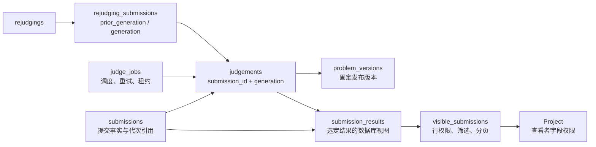
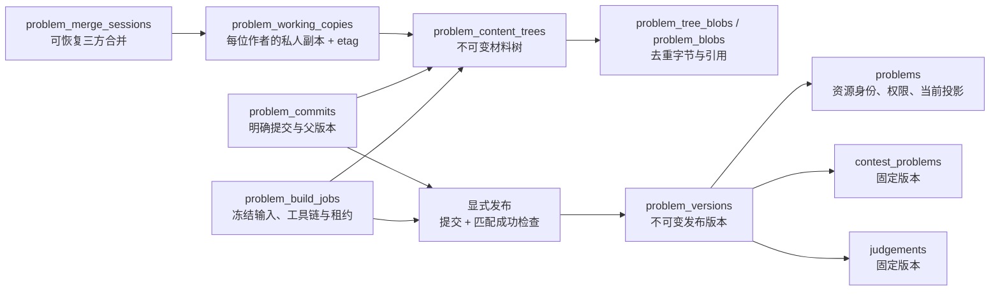

# 后端模型与身份边界

本文对应开发阶段重构后的初始 schema。没有生产迁移兼容层；旧开发库需要重建。

## 身份与 API

数据库 UUID 是内部身份，外键、授权锁和 Worker 协议继续引用它。题目、比赛、提交、题单、题解、公告和群组另有 `(domain_id, public_id)` 唯一编号：题目从 1000 开始，其他资源从 1 开始。编号在插入事务内分配，删除后不复用。

浏览器 API 只通过 `/api/domains/{domain}/…` 访问这些资源。响应的 `id`、关联 `problemId` / `contestId`、路径、筛选参数和请求体全部使用公开编号字符串；不再返回重复的 `publicId` 字段，也不接受内部 UUID 作为这些资源的公开引用。字符串避免 JavaScript 大整数精度损失。账号、域、评测任务和重测批次等未编号对象的 ID 仍是 UUID；讨论、答疑等子资源沿用自身的整数标识。出题材料使用内容树内稳定的 entry ID，blob/tree 使用摘要，提交使用题目内递增 revision；这些不是另一套公开题号。

公开编号解析由资源所属 repository 的 `ResolveNumber` 实现，HTTP 组合层只注册依赖。各模块 router 显式声明参数种类，请求 DTO 用 `resource` 标签声明关联引用；不解析 URL 字符串猜资源类型，不改写请求 URL 或原始路由参数。解析只定位资源，后续权限检查仍然必需。

`resourceid.Number` 是正数范围内的规范十进制编号。比赛题号是另一个类型 `contest.ProblemLabel`，只在某场比赛内有意义，例如 A、B2；它不是题目的永久编号。

用户资源操作必须显式绑定域。`WithScope` 携带已解析的请求上下文；可信内部调用可用 `WithDomain` 指定租户，但它不授予权限。缺少域不会默认进入 official，写事务仍在锁内重新读取账号、成员和资源权限。

## 事实、读模型与展示

- `Problem` 与 `Contest` 保存业务状态；`ProblemView` / `ContestView` 增加拥有者名称、统计、当前查看者权限或进度。
- `Submission` 是提交事实；`Judgement` 是一次评测结果；`SubmissionRecord` 是查询取得的事实及投影所需上下文。
- `SubmissionView` 和 `ProgressView` 是允许返回给当前查看者的展示结果。`Project` 复制数据，不把真实 Accepted 改写为存储模型中的 Pending / Submitted；未知反馈策略按隐藏结果处理。
- 源码权限、反馈级别和封榜分别表达。编译诊断也可能包含源码，不能只隐藏 `sourceCode`。

数据库函数 `visible_submissions` 是列表、总数、详情和 progress 共同的行可见性规则。筛选和分页在数据库中执行，应用层统一执行字段投影。一次读取的观察时间沿查询与反馈投影传递，避免跨越比赛时间边界时使用不同时间。写入授权和 Worker 租约继续使用当前时间。

## 提交、评测与重测

`judge_generation` 单调增加，用于执行隔离；`result_generation` 指向当前采用的评测结果。二者由外键及正数约束保护。新重测创建新的 judgement 和 job，旧结果保留；重测期间选定新一代 Pending 结果，保持原有榜单行为。

取消批次时，只取消尚未领取的任务，并把这些提交的 `result_generation` 指回旧结果；已经运行的任务继续执行。取消不倒退 `judge_generation`，不会复制旧分数、源码或逐点 JSON。过期 Worker 仍须通过 job、generation、worker、lease token 和有效期检查。重复完成只允许匹配原租约身份的幂等重试。

逐点结果只保存在 judgement 的 `case_results`，数据库约束检查正数且不重复的测试点序号。移除了没有业务读取者的 `submission_cases` 镜像表。重测批次记录结果引用，不再维护 `prior_status`、`prior_score`、`prior_case_results` 等另一份事实。

判题完成、结果保存、榜单和练习统计更新仍在同一事务。`workflows/evaluation/postgres` 组合各业务所有者的投影更新，显式注入到评测与重测 repository；这些 repository 不再直接依赖另外两个模块的计分/统计实现。投影失败时整个结果提交回滚。

## 题目生命周期

保存只改变个人副本；提交、检查和发布是独立操作。内容树和 blob 是不可变事实，列表标题等 summary 是可重建投影。新上传的字节只有授权者和其引用获得者可读取；私人副本与私人检查不会因共享题目权限而自动共享。

可见性、所有权和分类属于资源治理，不改写历史提交。发布核对预期公开版本、数据指纹、检查策略和工具链，题面修改可以复用相同评测材料的成功检查。比赛采用新版本和重测是独立动作。

五张旧共享编辑表已移除，不再维护每次保存增长的 package/data revision 或当前候选产物。完整流程与格式边界见[出题工作台](08-problem-authoring.md)。

## 比赛策略

`Contest` 按 `Schedule`、`ScoringPolicy`、`FeedbackPolicy`、`RegistrationPolicy`、`AccessPolicy` 和奖牌配置分组。分组是 Go 模型边界，不为每组设置创建一张表。

`penaltyMinutes` 使用可选输入：创建时未填写才采用 ICPC 的 20 分钟默认值，显式 0 保留，更新时省略则保留当前值。报名开关同样保留显式 false，创建默认允许开赛后报名。权限判断只读取解析后的 `Access`；`Viewer.Role` / `Staff` 是展示元数据，不再作为缺少权限快照时的授权替代。

## 验证边界

重要回归包括：编号不复用、缺少作用域、同编号不同域、拒绝 UUID 公开引用、真实 HTTP JSON 的反馈隐私、源码及编译诊断权限、版本固定、旧租约回报、重复完成、重测取消与连续代次、失败事务回滚、榜单重建，以及预设的显式零值。

模块单测和真实 PostgreSQL 回归不替代 Worker E2E。完整验证还需运行当前 Server/Worker 的程序执行与题目构建场景。OpenAPI、sqlc 和 UI 客户端必须一起重新生成，并验证重复生成不再产生变化。
