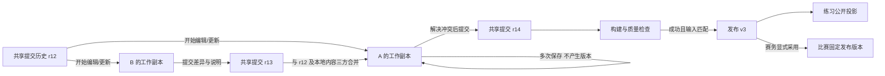
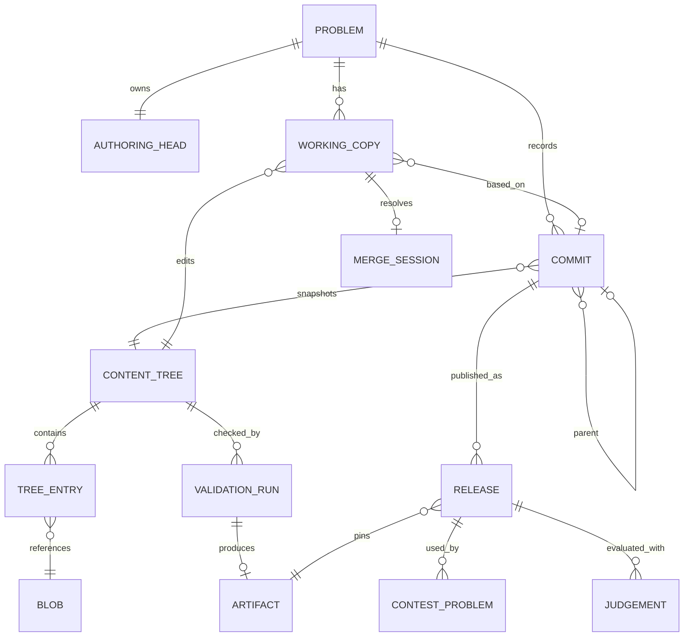

# 出题系统重构调研与产品设计

调研日期：2026-09-19。代码基线：`04ef7d3`。状态：设计基线，**不是已实现功能清单**；实施进度见 [实施计划](../plans/2026-09-19-authoring-workbench.md)。

## 1. 要解决的实际问题

出题应当是“持续编辑一份题目 → 保存自己的工作 → 与协作者合并 → 留下有意义的提交 → 检查 → 发布”，而不是操作数据库字段的后台。

本次同时重做领域模型、工作流、API、出题界面、mock 和题包互操作。保留现有正确的域隔离、公开编号、权限检查、评测沙箱、任务租约和不可变发布边界。没有生产环境，不设计旧 API 兼容层，不新增增量迁移；最终模型并入 `000001_init`。

### 现状核查

| 发现 | 当前代码证据 | 影响 |
| --- | --- | --- |
| 保存并不立即发布，但每次保存增加计数 | `authoring/infrastructure/postgres/package_repository.go`、`queries/package_write.sql` | `package_revision` 被界面叫作“包版本”，与正式版本混淆；无内容变化保存也会递增 |
| 每题只有一个共享工作区 | `problem_workspaces.problem_id` 为主键，题面/程序/测试表均直接属于题目 | 事务锁只能串行写入，不能识别基于旧内容的覆盖；没有个人副本与提交基线 |
| 发布前没有真正的提交历史 | `authoring/infrastructure/postgres/release.go` 直接快照当前材料 | 无法比较未发布的历史、恢复某次编辑或合并协作者修改 |
| 一个候选槽位代表最近数据 | `problem_candidates`、构建完成逻辑 | 修改计数和最近候选主导流程，不利于同时验证多个历史提交 |
| 包导入能力与完整题包不是一回事 | `authoring/infrastructure/filesystem/package.go` 接受扁平连续编号 `.in/.out` 和 checker | 不接受标准包中的目录、元信息、`.ans`、题面及参考解；不能把它宣传为 Kattis 兼容 |
| 构建测试定义只有输入和生成命令 | `authoring/domain/model.go` 的 `Test` | 导入已有答案、附件、多文件程序、校验器测试难以建模 |
| 评测协议不等价 | `worker/internal/checker/checker.go`、`testlib.go`、`builder/builder.go` | 现有比较器去行尾空白，validator 成功码为 0；不能直接用于 Kattis 默认判定和 validator |
| 界面仍像多张管理表 | `ui/src/pages/admin/ProblemWorkspacePage.tsx`，本地 mock 页面实查 | 8 个横向页签、重复状态条、长题面表单；版本与下一步操作不清楚 |
| 文档已经落后 | `docs/08-problem-authoring.md` | 仍写旧官方域兼容 API、admin 路由限制和“答案永远不能人工上传”；当前路由已是登录与资源授权 |

现有的“编辑不影响公开题面”和“比赛固定发布版本”是正确设计，不应为了重置工作台而丢掉。需要替换的是共享可变材料与提交/构建之间的关系。

## 2. 外部流程调研

下表归纳可核实的外部行为；第 3 节以后是 Vertex 的设计决策，不代表原产品实现。

| 参考 | 可借鉴的事实 | Vertex 采用方式 |
| --- | --- | --- |
| Polygon 官方 API | working copy、update/discard、commitChanges 是独立操作，提交可附说明；包构建与获取又是独立接口 | 保存不提交，提交不发布，构建绑定内容；保留简单的一条共享提交历史。[API](https://codeforces.github.io/polygon-misc/API) |
| Polygon 冲突交互 | 官方开发者介绍了本地、远端、合并结果编辑器，并可查看共同祖先；该文是历史设计介绍，不能视为当前全部能力 | 提供可恢复的冲突页；文本与结构冲突都应可在产品内处理，而非要求用户丢弃副本。[官方开发者说明](https://mirror.codeforces.com/blog/entry/92689?mobile=true) |
| 洛谷数据配置 | ZIP 中 `config.yml` 可指定每测试点时限、内存、分值、pretest 和 subtask，网页修改有覆盖优先级 | 易用的批量数据入口、表格编辑、分组；导入先显示差异和映射，不静默应用覆盖。[帮助中心](https://help.luogu.com.cn/manual/luogu/problem/testcase-config) |
| ICPC/Kattis 规范入口 | 分别列出 legacy、legacy-icpc 和 2025-09；入口仍把后者标为 release candidate，并提醒实际工具支持不同 | 显式格式版本和兼容报告，不能把“最新网页”当成全部下游已支持。[规范入口](https://icpc.io/problem-package-format/) |
| ICPC legacy 子集 | 包含元信息、题面、输入/答案、参考解和输入验证器；传统题面是 TeX/PDF，答案扩展名为 `.ans` | 首要互操作目标；Markdown 不能直接伪装成合法 legacy 题面。[规范](https://icpc.io/problem-package-format/spec/legacy-icpc.html) |
| Kattis legacy | 普通/计分类题、分组及自定义验证有明确语义；输入验证成功为 42，输出验证 AC/WA 为 42/43；默认 token 比较与 Vertex 当前 diff 不同 | 给验证器和比较器显式协议，按格式适配，不通过改扩展名“兼容”。[规范](https://icpc.io/problem-package-format/spec/legacy.html) |
| 2025-09 格式 | `statement/` 支持 Markdown；`test_group.yaml` 定义分组计分，另有校验器正反例和扩展题型 | 独立适配器与能力检测；高级语义不得当普通题丢弃。[规范](https://icpc.io/problem-package-format/spec/2025-09.html) |
| DOMjudge | 基于 ICPC 包，有 `domjudge-problem.ini` 等扩展，其中 timelimit 以秒计 | 可选 DOMjudge 导出配置，保留真实固定时限，不向标准 `problem.yaml` 塞未定义字段。[官方文档源码](https://raw.githubusercontent.com/DOMjudge/domjudge/main/doc/manual/problem-format.rst) |
| problemtools / BAPCtools | 前者提供包验证与题面转换；后者提供生成、验证和参考解运行，并明确不自带不可信程序沙箱 | 用作互操作验证参考，不在 Web 服务进程直接执行上传内容。[problemtools](https://github.com/Kattis/problemtools)、[BAPCtools](https://github.com/RagnarGrootKoerkamp/BAPCtools) |

查证限制：Polygon 主站文章和 Kattis 部分域名间歇拒绝访问；使用同属 Codeforces 的镜像文章、官方 GitHub API 文档与 ICPC 规范镜像核实。没有登录外部平台、上传项目材料或猜测其内部数据库结构。

## 3. 产品语义：用户只需要理解四件事

| 操作 | 用户看到什么 | 是否产生历史提交 | 是否影响选手 |
| --- | --- | --- | --- |
| 保存工作副本 | 保存中 → 对勾 → 已保存，保留未提交标记 | 否 | 否 |
| 提交更改 | 差异、提交说明、作者、提交序号 | 是，只有内容变化才产生 | 否 |
| 检查 | 针对明确内容的报告、耗时、失败项 | 否 | 否 |
| 发布 | 指定提交和成功检查结果生成发布记录 | 不额外制造材料提交 | 新练习使用新发布；已编排比赛仍使用原发布 |

内部并发 token 永不叫“版本”。产品中的 `r12` 表示第 12 次显式提交；`v3` 表示第 3 次发布。构建用状态、来源提交和时间表达，普通页面不再展示“候选 v38 / 数据 revision 55”。需要定位时在详情里显示任务编号和内容摘要。



允许检查未提交工作副本：服务端固定其内容快照，报告标为“工作副本检查”。提交相同内容后，可在核对内容、工具链和检查策略摘要完全一致时复用报告。检查不暗中替用户提交，报告不自动追随之后的保存。

历史支持查看差异、从指定提交恢复到工作副本、导出指定提交和发布记录。恢复产生工作副本变更，后续显式提交；不改写旧历史。先做单一共享主线与每人一个副本，不把分支、远端、rebase 等 Git 概念全部搬进 UI。

## 4. 工作副本与冲突

### 隔离和并发

- 工作副本属于 `(problem, actor)`，有基线提交 `base_commit`、当前清单和不透明 `etag`。读者审阅共享提交；不能借题包阅读权限枚举其他人的私人草稿。
- 每次保存、导入、更新和解决冲突均提交所见 `etag`。过期写入返回 409 及冲突定位；前端保留本地文本，禁止用“刷新重试”覆盖。
- 同一人的多个浏览器也可能冲突，不能只按“不同作者”判断。
- 提交时锁定题目历史头与当前副本，重查账号、域和编辑授权。基线落后时计算三方合并；无冲突可合并提交，有冲突保存合并会话，不移动共享历史头。
- 提交说明必填；相同内容的重复保存是 no-op；重复提交使用请求幂等键返回原结果。无更改不产生空提交。
- ACL、所有权、公开/私有状态是资源治理设置，立即生效并单独审计，不随恢复历史回滚。

### 三方合并的粒度

比较共同基线 B、我的工作 L、共享最新 R。若 L=B 采用 R；若 R=B 采用 L；若 L=R 采用任一。其余按以下方式处理：

| 材料 | 自动处理 | 人工解决 |
| --- | --- | --- |
| 元信息/限制/角色配置 | 不同字段分别合并 | 同字段不同值显示两值与基线 |
| 题面、源代码、说明 | 独立条目自动合并；同一文本可合并不重叠行块 | 重叠修改提供我的/最新/合并结果，基线可展开 |
| 测试点、分组 | 使用稳定条目标识，而非列表位置；内容和排序分开 | 删除与修改、冲突排序、互斥主解/校验器选择明确列出 |
| 大输入、答案、图片、PDF | 相同 blob 摘要直接复用 | 不对数据文件做行级拼接；整项选择或上传替代 |
| 重命名 | 保留条目标识，一方改名另一方改内容可组合 | 双方改成不同名字、目标路径撞名由用户选择 |

冲突会话固定 B/L/R 和本地 etag；逐项保存解决草稿后才能“完成合并”。完成时若共享头或本地副本又变化，重新校验/合并，不把旧决定强塞给新历史。关闭页面可继续；冲突页必须独立可访问，即使材料暂时不满足可构建约束。

并发示例：甲改中文题面，乙加边界数据，可直接合并；两人改同一个时限则必须选择；甲删 checker、乙改 checker，保留冲突并禁止发布，不能以删除优先。

## 5. 领域模型与存储

采用 PostgreSQL 管理提交与原子引用、不可变内容存储管理大文件。**不为每题创建 Git 仓库**：现有事务授权与发布引用可以留在一个数据库中，避免 Git 锁、数据库事务和大数据包之间出现第二套一致性协议。仅借鉴版本控制语义。



建议职责如下，名称在实现中以清晰查询为准：

| 模型 | 内容与约束 |
| --- | --- |
| `problems` | 题目身份、域、owner、公开编号、访问状态、当前发布指针及公开读取投影 |
| `problem_authoring_heads` | 共享最新提交引用；与题目同事务锁定 |
| `problem_working_copies` | 作者、基线提交、当前 tree、并发 token；每人每题一份 |
| `problem_commits` | 题内序号、父提交、tree、作者、说明、时间；只追加 |
| `problem_content_trees` / entries | 规范化元信息、小结构字段和稳定条目标识；大正文/数据只存 blob 引用 |
| `problem_blobs` | 摘要、字节数、存储引用；内容不可变。API 不提供“知道 hash 即可下载”的全局端点 |
| `problem_merge_sessions` | 三个固定输入、冲突项和解决草稿；完成前不动共享提交 |
| `problem_build_jobs` / reports | 固定 tree、数据指纹、工具链/验证策略版本、来源提交或私人副本、租约和报告 |
| `problem_artifacts` | 数据和运行材料清单、摘要、产出检查引用；代替“最新候选”单槽语义 |
| `problem_versions` | 保留发布含义，绑定 commit、artifact、完整题面与限制快照；比赛/评测仍固定它 |

题面每语言独立条目；程序可包含多文件、明确入口、语言、角色和协议；测试点包含稳定 ID、样例/秘密标志、组、输入来源、答案来源、预期判定、限制等。排序不复用数据库主键。题面附件与秘密数据的用途显式区分。

内容 tree 是历史事实源，禁止再维护一份可独立写入的“同内容表”。列表和公开页可以有可重建投影；领域规则不依赖缓存状态。跨题复制在目标创建独立历史，授权不从源继承，数据引用在来源删除后仍有效。

保存只写变更 blob 与新清单，不复制全部测试数据。哈希采用稳定排序、明确类型与编码；Windows 文本编辑统一 LF，但二进制和导入测试数据不偷偷改字节。存储引用按资源授权，去重也不得泄漏私有文件是否存在。

数据库和文件系统不组成虚构的分布式事务：先写不可变临时/内容对象，再在事务中引用；失败留下可回收对象，回收使用引用检查与宽限期。不能在补偿时删除其他并发请求已引用的同摘要对象。备份需要同时包含引用数据库和内容存储。

## 6. 出题内容与检查流程

用户可以从空题、现有发布副本或完整题包开始。工作台提供题面、程序、数据和检查四个主要编辑区；版本、发布和协作是工作流区。

### 测试数据的来源

同时支持手写输入、上传输入/答案对、生成器批量产生。答案来源可以是“包内答案”或“由指定参考解生成”，并写入来源信息。修改输入后必须重新验证配对；不能因为两个文件同名就宣称数据正确。更换标程不静默重写导入答案。

支持样例、秘密测试、分组、批量移动、批量限制、生成器参数及种子。大文件按流上传/下载，不塞入 workspace 列表 JSON；列表只有大小、摘要与有界预览，编辑必须读取完整内容。

### 质量检查

1. 静态材料检查：文件关联、必需内容、组依赖、角色、协议、重复测试提示。
2. 构建：在沙箱中编译/准备程序，固定工具链与依赖摘要。
3. 生成与输入校验：按选定来源产生数据，运行全部适用验证器。
4. 答案验证：生成或保留答案，运行参考解并通过输出验证器核对；多解题不能要求参考输出字节相同。
5. 校验器自测：输入验证的正反例、输出验证的正确/错误输出用例。
6. 参考解矩阵：AC 解、WA 解、TLE 解等的实际结果与预期比较，可定位到用例。
7. 产物固化：记录数据/程序/策略摘要，提供可复用的检查结果。

报告区分材料错误、预期不符、基础设施失败、取消和通过，不能把 checker 崩溃算选手 WA。所有用户提供的程序及转换脚本进入受限执行环境；保留超时、输出限制、无网络与租约隔离。

题面编辑只使题面验证过期，可复用相同数据指纹的构建；判题相关材料变化使数据检查过期。数据指纹必须包含限制、程序角色/协议、输入/答案、组规则、生成参数和工具链，不能只 hash 测试输入。发布要求完整 tree 的静态检查与匹配数据报告均通过。

## 7. 题包互操作与兼容边界

把“可识别/保存”“可编辑”“可执行验证”“可发布”“可无损导出”分开报告。不能只以 ZIP 解压成功宣称支持标准。

| 格式 | 本轮目标 | 不能静默转换的边界 |
| --- | --- | --- |
| Vertex 原生归档 | 完整往返元信息、多语言题面、程序、测试/分组、附件；导出指定提交或工作副本 | 不包含站点 ACL、账号信息、评测凭据；历史备份与单提交题包分开 |
| ICPC `legacy-icpc` | 传统批处理题的完整导入、验证、导出；包含 input/output validator 和参考解 | 保留 TeX/PDF；不能导出仅有 Markdown 的假标准包；默认判定和 custom 协议必须正确 |
| Kattis `legacy` | 同上，并识别分组/计分等扩展 | 支持的分组语义必须端到端正确；未实现的 grader/交互语义明确阻止发布，不降级成普通题 |
| Kattis `2025-09` | 明确版本的批处理材料适配及导入/导出；MD/TeX/PDF、样例、秘密数据、校验器自测 | 对 static、multi-pass、特殊 scoring、include 等逐项报告能力；未实现项保留材料并阻止错误发布 |
| DOMjudge | 在 ICPC 包上识别并输出必要扩展，尤其固定时限 | 导入题包不替用户改变比赛颜色、题号、报名/可见性与资源权限 |
| Polygon | 借鉴完整出题生命周期；导入常用已生成题包的题面、源文件、测试与 testlib 角色 | 官方 API 文档不是完整 XML 规范；用可核实样例补测试，不承诺任意 Polygon 包的无损导出 |
| 洛谷/平面数据 ZIP | 便利的数据导入通道，识别 `config.yml`，导出已有输入/答案对 | 这只是测试数据，不冒充完整题包；pretest/subtask 等不能静默丢弃 |

此处定义的是本轮可兑现的兼容范围，不把全语言、自定义任意构建环境、任意交互与所有评分扩展一并宣称实现。超出范围的材料必须可辨识、可保留且能看到准确阻断理由；未支持核心批处理路径则不得标记本 goal 完成。

### 导入流程

上传 → 识别格式/版本 → 预检 → 显示材料清单、冲突和不支持项 → 确认替换或按路径合并到自己的工作副本 → 保存 → 提交 → 检查 → 发布。

预检返回绑定上传摘要和副本 etag 的 token；确认时再次校验，防止报告与实际导入字节不一致。整个导入原子应用，失败不留下半套题面和测试。重复根目录、缺答案、重名和配置冲突必须定位具体文件。

包中 UUID 是外部来源标识，不能覆盖 Vertex 内部题目 UUID 或用来绕过域与题号寻址。公开附件由用途白名单派生；秘密数据、参考解、生成器、题解不会因导入目录名称相近而进入公开 DTO。

### 导出流程

选择格式与提交/发布 → 显示兼容检查 → 生成确定性归档。相同材料、格式和导出器版本产出相同清单；排序、时间戳和权限规范化。工作副本导出明确标明未提交，不伪造 revision。

不能把任意 TeX 自动转成 Markdown 后丢掉源文档；原格式保留，支持的预览转换放到隔离任务。Vertex Markdown 导出 legacy 时需实际生成合法 TeX/PDF并验证，不能更名文件了事。时限缺失/推导与固定时限必须在导入报告中可见，避免不知情地使用 1000ms。

归档读取检查实际解压字节、条目数量、单文件大小、嵌套深度、重复路径、大小写冲突、Windows 盘符/设备名、目录穿越和链接。内部安全软链接可在受控逻辑中解析为普通文件；绝不让系统解压器跟随任意链接。YAML/XML 禁止外部实体和无界展开。包导入阶段不执行任何 build/run。

## 8. 界面设计

### 工作台列表

保留 `/workspace/problems` 作为入口。统一 `PageHeading`、筛选行、紧凑列表。列为题号、标题、我的工作状态、最近提交、发布状态、更新时间；权限与高级操作收进菜单。提供“新建题目 / 导入题包”。mock 保留少数有意义的案例：初稿、未提交、可发布、检查失败、协作冲突、标准包导入。

### 单题工作台

```text
工作台 / #1000 两数之和                  已保存   [查看更改 · 3] [提交更改]
┌──────────────┬─────────────────────────────────────────────────────┐
│ 题目概览     │ 题面                              中文 ▾  编辑 / 预览 │
│ 题面         │ ┌─────────────────────┬───────────────────────────┐ │
│ 程序         │ │ 编辑区              │ 阅读效果                  │ │
│ 测试数据     │ │                     │                           │ │
│ 检查         │ └─────────────────────┴───────────────────────────┘ │
│              │ 就近校验、保存状态、未提交提示                       │
│ 更改与历史 3 │                                                     │
│ 发布         │                                                     │
│ 协作与设置   │                                                     │
└──────────────┴─────────────────────────────────────────────────────┘
```

- 左侧为稳定导航，使用 `/authoring/:id/statement`、`/tests`、`/checks`、`/history`、`/releases` 等真实路径；不要用无状态页签或 `?tab=` 混搭。
- 标题区只显示身份、工作状态和主操作，不再叠一条长候选卡片。只在有新共享提交/冲突/检查阻断时显示相应提示。
- 在窄屏导航改同主站/比赛的覆盖式侧栏，关闭按钮固定正方形；抽屉无多余标题和大空白。题目标题可截断，完整名称可访问。
- 普通内容复用站点容器和 padding token；长表单限制宽度，概览可两列合理分区，代码/数据/差异界面按实际阅读需求展开。
- 大屏题面和预览并列，小屏在编辑/预览间切换；支持全屏编辑。可选结构模板，不让全部字段变成一串巨大 textarea。
- 程序页左侧文件树/角色列表，右侧代码和配置；不用一张卡片包一张卡片。参考解结果用矩阵与可展开详情。
- 数据页行高与榜单一致方向，固定对齐的编号和状态图标。样例、秘密、组与生成来源各有明确标记，批量操作只在选择后出现。
- 更改页显示文件/字段差异和提交说明；冲突使用三方内容、逐项解决和有界编辑器，手机逐块切换，不横向挤三列。
- 发布页显示“将发布 r14，检查通过，当前 v2”，提供差异、检查和影响范围；成功动效就近展示，不能靠全页刷新。
- 协作/所有权/可见性放设置，不夹在编辑材料中。只读模式保留复制、预览和历史阅读能力。

### 反馈细节沿用既有产品要求

按钮轮廓、按钮高度、图标尺寸统一；字段错误就在字段旁；保存按钮状态完整衔接，防止 loading 结束后瞬间闪回初始文字；非字段通知避开 menu bar。请求只刷新受影响内容，保留光标、滚动和展开项。过渡短而克制，支持 reduced-motion；不新增夺目的亮绿大片成功背景。

自动保存仅保存副本：编辑停顿/失焦保存文本，显式按钮可立即保存。未完成上传和失败保存必须清楚提示，离开页面前保护未同步编辑。每个请求携带基于读取时点的 token；切域、切题、换账号、退出权限后清理对应缓存，迟到响应不能写回另一份副本。

## 9. 发布、权限与后端数据边界

owner/域资源管理者负责发布与资源治理；editor 可编辑自己的副本、提交和运行检查；reader 可审阅共享提交/报告。若以后需要发布者角色再显式加能力，不用字符串角色暗中越权。

只读访问既不能创建工作副本，也不能触发隐式写入。读取历史、下载文件、导出、导入预览、构建日志和复制均需域与资源权限。查看某个历史 tree/blob 必须验证它属于该资源且可供当前用户读取；“hash 很难猜”不算授权。

公开题面只投影已发布允许的题面与附件；API 原始 JSON 不能包含工作副本、未公开题解、参考解、秘密用例内容/路径或出题诊断。检查日志只供对应授权者，选手评测仍沿用比赛反馈与源码可见性规则。

发布事务检查 `(commit, artifact, check-policy, selected language, expected current release)`，失败完整回滚。重复请求幂等。重新发布历史提交形成新的发布记录/明确切换，不能修改旧快照，也不能自动重测或升级比赛。

## 10. 实施取舍与验收

重构按纵向闭环推进：先实现个人副本—提交—合并，再把编辑器、构建和发布切过去，随后接完整题包互操作。不同阶段可以在同一开发分支暂时共存，但最终不得保留两个都能修改题目事实的入口。

重点不是增加测试数量，而是验证：保存 20 次只产生一份草稿；两人修改不丢数据；过期浏览器不能覆盖；历史恢复不改发布；导入导出不换判题语义；普通选手从原始 API 获取不到秘密材料；任务过期 Worker 不能发布产物。

性能检查包括大数据上传不加载整包进 JSON、列表有界分页、diff 按项加载、内容复用、构建轮询不覆盖未保存编辑。真实 PostgreSQL 事务与真实 Worker E2E 是完成条件，mock 和纯函数测试不能代替。

完整里程碑、验收用例和可恢复的进度见 [实施计划](../plans/2026-09-19-authoring-workbench.md)。

## 11. 实现过程中的格式核对（2026-09-19）

- [ICPC 2025-09 标准](https://icpc.io/problem-package-format/spec/2025-09.html) 的显式资源限制需要精确执行；不能把导入的固定时间/内存再乘上站点的语言倍率。新材料因此显式区分精确限制和站点倍率，并纳入检查指纹。
- [洛谷题包说明](https://help.luogu.com.cn/manual/luogu/problem/) 要求平铺数据和带数字的文件名；[测试点配置说明](https://help.luogu.com.cn/manual/luogu/problem/testcase-config) 包含逐点时间、内存、分值、预测试与 subtask。数据导入应合并到题目材料，不能把只有数据的 ZIP 当作完整题目替换题面和程序。当前时间/内存已映射，其余未执行语义保留配置并阻断检查。
- 已用官方 `problemtools/icpc` 固定摘要镜像实际验证导出的 legacy 包。验证器版本 1.20260907 的 `--version` 只声明 legacy 及部分 2023-07-draft；其 [官方 README](https://github.com/Kattis/problemtools/blob/6010cbaa37a1612117f49566b2fff8646d53faa2/README.md) 也明确新格式支持尚不完整。2025-09 的实现检查/双向测试与外部验证要分开记录，不可混为一谈。
- 互操作夹具使用自行编写的 Sum 题面、验证器、正确解和错误解，保留数值等价但字节不同的答案 `03`，显式零浮点容差；外部验证同时检查参考解行为，避免仅凭自己的导入器认为自己的导出正确。

## 12. 演示归档与真实格式区分（2026-09-19）

演示模式使用固定版本 fflate 0.8.3 的流式 ZIP 解压接口，并独立核对中央目录、路径/类型、CRC、声明大小和实际展开预算；API 依据[上游流式接口说明](https://github.com/101arrowz/fflate#usage)。原生归档通过 Web Crypto 计算真实 SHA-256，可被 Go 后端直接导入；mock 的内部 blob 标识不写进可交换归档。代表性演示只覆盖原生往返与平铺数据合并，不复制后端的 Kattis/Polygon 语义解释器，也不把演示成功当作真实沙箱或外部标准认证。

## 13. Markdown 题面标准导出（2026-09-19）

- 使用仍受上游维护的 goldmark v1.8.6 AST 解析常用 Markdown，输出真正的 TeX 片段；不通过正则替换全文或改后缀。解析器版本来自 Go 模块解析，上游[维护说明](https://github.com/yuin/goldmark#maintenance-policy)与 v2 API 分开核对。
- [legacy-icpc 规范](https://icpc.io/problem-package-format/spec/legacy-icpc.html)要求题面辅助图片位于 problem_statement 内，并使用相对该目录的路径；明确不把样例写进题面正文。转换因此复制已声明的公开图片并重写引用，样例交由 data/sample 和目标模板提供，无法可靠识别的内嵌样例拒绝导出。秘密测试的说明图片不会被提升为公开附件。
- 同一规范明确要求 problem_format_version 为 legacy-icpc，但固定的官方 problemtools 镜像实际报“not a valid FormatVersion”。保留正确声明，不为了通过工具而偷偷改成 legacy；内部 roundtrip 与外部认证范围分开记录。
- Markdown 转换出的 legacy 包通过 verifyproblem，参考解 AC、错误解 WA、零错误/警告；随后通过 problem2pdf 的真实 LuaLaTeX 与 Ghostscript 流程，完整页面图像实查。该版本 CLI 帮助仍写 pdflatex，实际实现使用 lualatex，不能仅据帮助文字推断执行器。Windows bind mount 下最终 PDF 在容器 /tmp 完成处理后按字节复制出，保留原有无网络/去 capability 限制。
